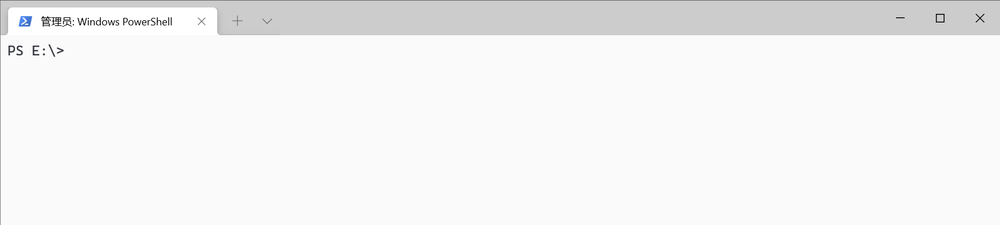

# MGet
A async way download tools.


# Build
```shell
cargo build --release
```

# Use
```
USAGE:
    mget [OPTIONS] --url <URL>

OPTIONS:
    -b, --batch-size <BATCH_SIZE>    Data unit: byte [default: 1048576]
    -f, --file-name <FILE_NAME>      Local storage file name, keep empty to use uri as file name
    -h, --help                       Print help information
    -o, --overwrite                  Overwrite local file
    -u, --url <URL>                  Download url
    -V, --version                    Print version information
```